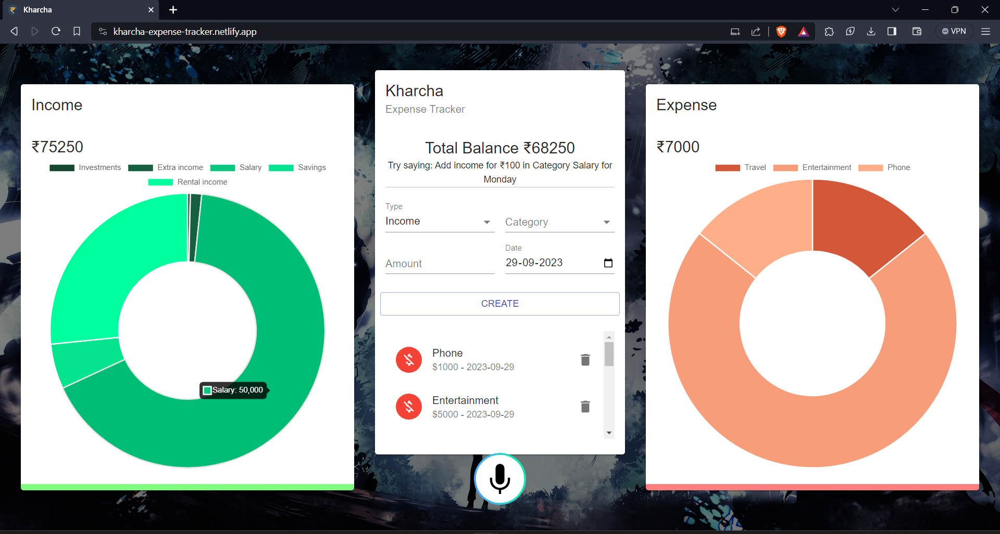

<a name="readme-top"></a>

<!-- PROJECT LOGO -->
<br />
<div align="center">
  <a href="https://github.com/Tusharknwl/expense-tracker">
    
  </a>

<h3 align="center">EXPENSE TRACKER</h3>

  <p align="center">
    React js expense tracking web application to help users track their spending habits. Integrated with voice capabilities enable users to add or remove transaction records via voice.
    <br />
    <a href="https://kharcha-expense-tracker.netlify.app">View Demo</a>
    ·
    <a href="https://github.com/Tusharknwl/expense-tracker/issues">Report Bug</a>
    ·
    <a href="https://github.com/Tusharknwl/expense-tracker/issues">Request Feature</a>
  </p>
</div>


<!-- TABLE OF CONTENTS -->
<details>
  <summary>Table of Contents</summary>
  <ol>
    <li>
      <a href="#about-the-project">About The Project</a></li>
    <li><a href="#built-with">Built With</a></li>
    <li><a href="#installation">Installation</a></li>
    <li><a href="#contributing">Contributing</a></li>
    <li><a href="#contact">Contact</a></li>
  </ol>
</details>


<!-- ABOUT THE PROJECT -->
## About The Project



A web-based expense tracking application using React.js that empowers users to monitor their financial habits. The application will also feature voice integration, allowing users to effortlessly add or delete transaction records using voice commands. The application will also feature a data visualization component, allowing users to view their spending habits in a graphical format.

<p align="right">(<a href="#readme-top">back to top</a>)</p>


### Built With

* React Js
* JavaScript
* Speechly API
* Material UI
* Chart Js

<p align="right">(<a href="#readme-top">back to top</a>)</p>


### Installation

1. Clone the repo
   ```sh
   git clone https://github.com/Tusharknwl/expense-tracker.git
   ```
3. Install NPM packages
   ```sh
   npm install
   ```

<p align="right">(<a href="#readme-top">back to top</a>)</p>


<!-- CONTRIBUTING -->
## Contributing

Contributions are what make the open source community such an amazing place to learn, inspire, and create. Any contributions you make are **greatly appreciated**.

If you have a suggestion that would make this better, please fork the repo and create a pull request. You can also simply open an issue with the tag "enhancement".
Don't forget to give the project a star! Thanks again!

1. Fork the Project
2. Create your Feature Branch.
3. Commit your Changes.
4. Push to the Branch.
5. Open a Pull Request

<p align="right">(<a href="#readme-top">back to top</a>)</p>


<!-- CONTACT -->
## Contact

[](https://tusharknwl.github.io/portfolio-2021)
[](https://www.linkedin.com/in/tushar-khanagwal/)

<p align="right">(<a href="#readme-top">back to top</a>)</p>
